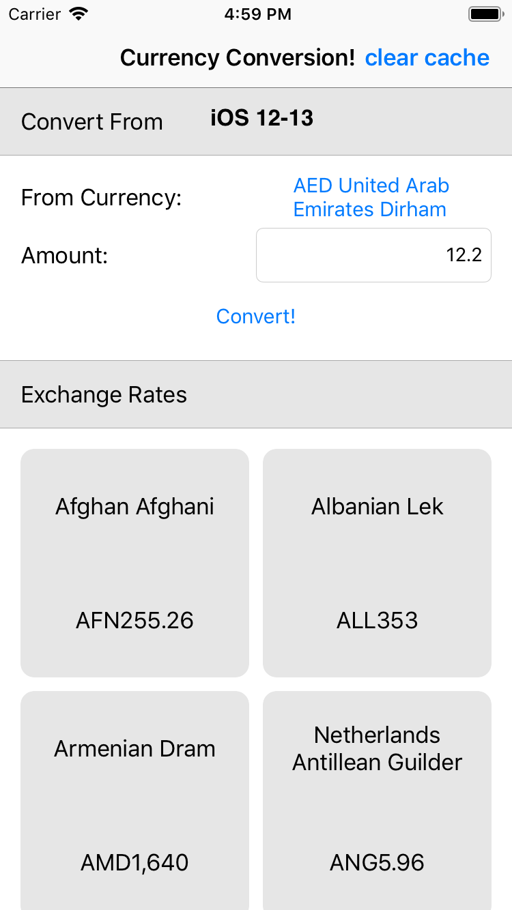

# Currency Converter App

Currency App to see the latest Conversion rates between your favorite currency and the world's currencies!

## Functional Goals

 1. Exchange rates API: https://currencylayer.com/documentation
 2. User must be able to select a currency from a list of currencies provided by the API
 3. User must be able to enter desired amount for selected currency
 4. User should then see a list of exchange rates for the selected currency
 5. Rates should be persisted locally and refreshed no more frequently than every 30 minutes (to limit bandwidth usage)

## Architecture Goals

1. Extendability
   - Ease of support of different web APIs but using same model
   - Ease of support of any database 
2. Abstraction
   - Testability
   - multiple implementations 
3. Dependency Inversion
   - Testability
4. DRY
   - Constants, Code Reuse
5. Hybrid SwiftUI and UIKit app
   - Future Proof
6. SRP
   - Each class, struct, type has only one responsibility.


## Installation 

0.  Acquire an API key from https://currencylayer.com/

1.  Create `Secrets.swift` in directory `CurrencyConverter/AppResources`


**Secrets.swift:**

```swift

enum Secrets {
    static let apiKey = "<Your Currency Layer API Key>"
}

```

2. `bundle install` at project root

3. `bundle exec pod install` at project root

4. `open CurrencyConverter.xcworkspace`


## TODO

1. Complete Unit Test and Integration Test Suite **partially done**
2. Core Data support
3. Centralized Color branding scheme

## APP 

### iOS 14


### iOS 12 to 13


